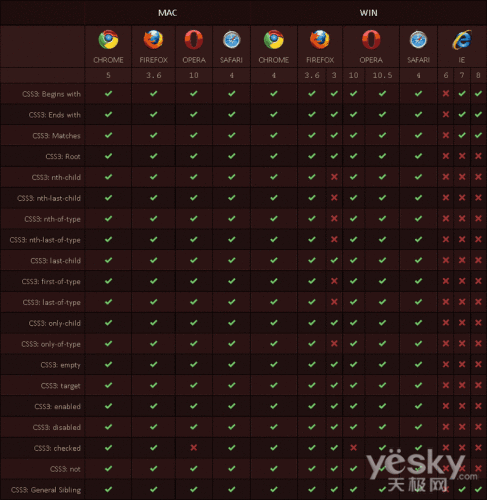

##后盾网css3学习笔记

###描述
+ 记得比较混乱，只记自己不熟的
+ 快速学习，后面还有很多

###笔记内容
####css3的支持度

####选择器
    1. 派生选择器
    2. id选择器
    3. 属性选择器
    4. 属性和值选择器
        <!DOCTYPE html>
        <html lang="en">
        <head>
            <meta charset="UTF-8">
            <title>属性选择器和值选择器</title>
        </head>
        
        <body>
            
属性选择器

            
属性和值选择器

        </body>
        </html>